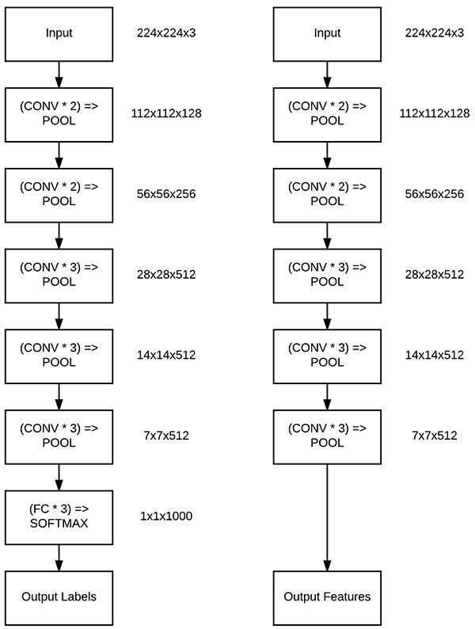
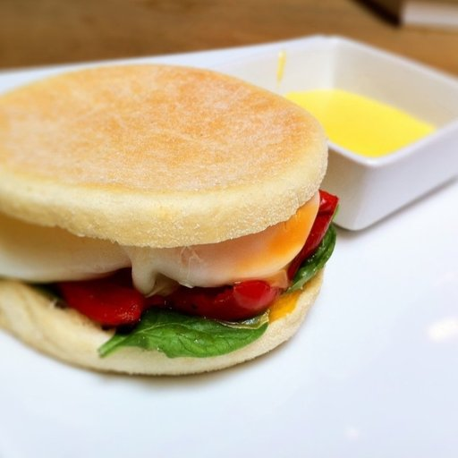

# Transfer Learning with Keras and Deep Learning in Python

There are two types of transfer learning in the context of deep learning:

1. Transfer learning via feature extraction
2. Transfer learning via fine-tuning

In this example, we will be treating networks as arbitrary feature extractors. When performing feature extraction, we treat the pre-trained network as an arbitrary feature extractor, allowing the input image to propagate forward, stopping at pre-specified layer, and taking the outputs of that layer as our features.

Left: The original VGG16 network architecture that outputs probabilities for each of the 1,000 ImageNet class labels. Right: Removing the FC layers from VGG16 and instead of returning the final POOL layer. This output will serve as our extracted features:



PyImageSearch Tutorial: https://www.pyimagesearch.com/2019/05/20/transfer-learning-with-keras-and-deep-learning/

## Dataset

Food             |  Non-Food
:-------------------------:|:-------------------------:
  | 

Food-5K dataset: curated by the Multimedia Signal Processing Group (MSPG) of the Swiss Federal Institute of Technology.

The dataset, as the name suggests, consists of 5,000 images, belonging to two classes:
* Food
* Non-food

Our goal of is to train a classifier such that we can distinguish between these two classes. MSPG has provided us with pre-split training, validation, and testing splits.

## Deployment

1. Download food data and put it in data/:
```
$ wget --passive-ftp --prefer-family=ipv4 --ftp-user FoodImage@grebvm2.epfl.ch \
	--ftp-password Cahc1moo ftp://tremplin.epfl.ch/Food-5K.zip
$ unzip Food-5k.zip
```

2. Build the docker image:
```
$ cd docker
$ make build
```

3. Create a docker container based on the image:
```
$ make run
```

4. SSH to the docker container:
```
$ make dev
```

5. Build our custom dataset:
```
$ python src/build_dataset.py
```

6. Extract features:
```
$ python src/extract_features.py
[INFO] loading network...
[INFO] processing 'training split'...
[INFO] processing batch 1/94
[INFO] processing batch 2/94
[INFO] processing batch 3/94
[INFO] processing batch 4/94
...
[INFO] processing batch 93/94
[INFO] processing batch 94/94
[INFO] processing 'evaluation split'...
[INFO] processing batch 1/32
...
[INFO] processing batch 30/32
[INFO] processing batch 31/32
[INFO] processing batch 32/32
[INFO] processing 'validation split'...
...
[INFO] processing batch 30/32
[INFO] processing batch 31/32
[INFO] processing batch 32/32
```

7. Train:
```
$ python src/train.py
[INFO] loading data...
[INFO] training model...
[INFO] evaluating...
              precision    recall  f1-score   support

        food       0.99      0.98      0.98       500
    non_food       0.98      0.99      0.99       500

    accuracy                           0.98      1000
   macro avg       0.99      0.98      0.98      1000
weighted avg       0.99      0.98      0.98      1000
```

## Resources

* https://www.pyimagesearch.com/2019/05/20/transfer-learning-with-keras-and-deep-learning/